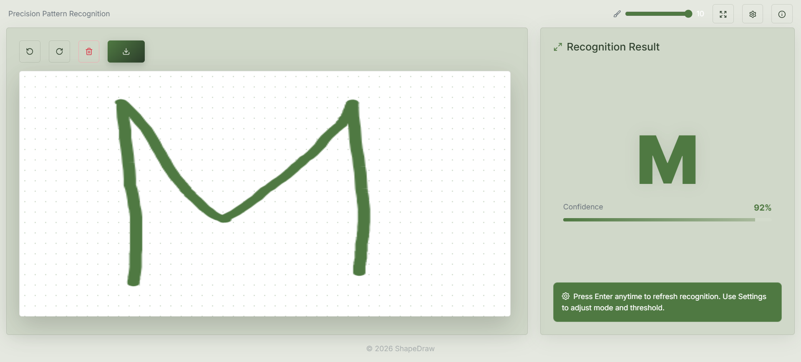

# ShapeDraw

ShapeDraw is a handwriting and symbol recognition web app built with React + TypeScript + Vite. It lets users draw directly on a canvas, then predicts the character or symbol that was written.



## What this system does

- Provides a clean drawing canvas with undo, redo, clear, and export controls.
- Recognizes handwritten letters, numbers, and common math symbols.
- Shows a **live recognition result** after each stroke completes, plus a **confidence** percentage and bar.
- Uses a hybrid recognition pipeline:
  - A template/grid matcher for fast structured matching.
  - Tesseract OCR to improve recognition of handwritten text.

## Using the app

### Header

- **Brush size**: Use the brush icon and slider (1–10) to make strokes thinner or thicker. Thicker strokes can help OCR see faint input; very thin strokes may work better for detailed shapes.
- **Fullscreen**: Expand the drawing area for distraction-free sketching. While fullscreen, the main result panel is hidden; a floating card still shows the current prediction.
- **Settings**: Open recognition mode and threshold controls.
- **Info**: Short in-app help (same topics as this README).

### Canvas toolbar (below the header, above the canvas)

- **Undo / Redo**: Step through drawing history. Recognition re-runs when you use these, so the prediction stays in sync.
- **Clear**: Wipes the canvas and resets the result to “?” with zero confidence.
- **Download**: Saves the current canvas as a PNG (`shapedraw-<timestamp>.png`).

### Settings (recognition tuning)

- **Recognition mode** affects how aggressively the grid matcher scores candidates:
  - **Standard**: Default balancing behavior.
  - **Sensitive**: Slightly boosts match scores—can help when strokes are light or ambiguous.
  - **Precise**: Slightly tightens scoring—favors higher certainty before picking a label.
- **Threshold** (about 10%–80%): Controls how strict the final decision is. **Lower** tends to allow more guesses; **higher** is stricter and may return “?” more often when unsure.

Recognition still uses **both** the 28×28 grid matcher and OCR; mode and threshold mainly tune how the combined result is chosen.

## Recognition flow

1. User draws on the canvas.
2. The drawing is converted to a 28×28 grid for template matching.
3. OCR (Tesseract) also reads the canvas content.
4. The app compares both results and returns the best final prediction.

## Keyboard shortcuts

| Key | Action |
|-----|--------|
| `F` | Toggle fullscreen drawing mode. |
| `Enter` | Run recognition again on the current drawing (useful after undo/redo or if the result feels stale). |
| `Esc` | Exit fullscreen (browser / OS behavior). |

When focus is inside an input (e.g. threshold slider in Settings), shortcut keys may be ignored so you can type normally.

## Confidence score

The percentage is a **relative confidence** for the displayed label, not a statistical guarantee. Use it to see whether the app is tentative; if confidence is low, try clearer strokes, a different brush size, or adjusting mode/threshold in Settings.

## Tech stack

- React 19
- TypeScript
- Vite
- Bootstrap 5 + Bootstrap Icons
- Framer Motion
- Lucide React
- Tesseract.js

## Known limitations

- **Handwriting quality**: Very light strokes, faint lines, or messy overlapping scribbles reduce accuracy for both the grid matcher and OCR.
- **Single-character bias**: The UI and engine are tuned for **one** clear letter, digit, or math symbol per canvas—not full words or multiple characters at once.
- **Tips for better results**:
  - Draw **larger** and center the symbol in the canvas.
  - Prefer **bold, continuous** strokes when lines are hard to see; use a **thinner brush** for fine detail if strokes look too “blobby” after downscaling.
  - **Clear the canvas** before a new symbol so leftover ink does not confuse recognition.
  - After **undo/redo**, press **`Enter`** to re-run recognition if the on-screen result looks stale.

## Getting started

```bash
npm install
npm run dev
```

Then open the local URL shown in the terminal (usually `http://localhost:5173`).

## Build for production

```bash
npm run build
npm run preview
```

## Install as desktop/mobile app (PWA)

ShapeDraw is configured as a Progressive Web App with:
- In-app **Install** button (shown when the browser allows install).

To install:

1. Open the app in Chrome/Edge on desktop or Android.
2. Click **Install** in the app header (or browser menu "Install app"/"Add to Home Screen").
3. Launch from desktop/home-screen icon in standalone app mode.

## Scripts

- `npm run dev` — Start the Vite dev server.
- `npm run build` — Typecheck and emit the production bundle.
- `npm run preview` — Serve the production build locally.
- `npm run lint` — Run ESLint on the project.
